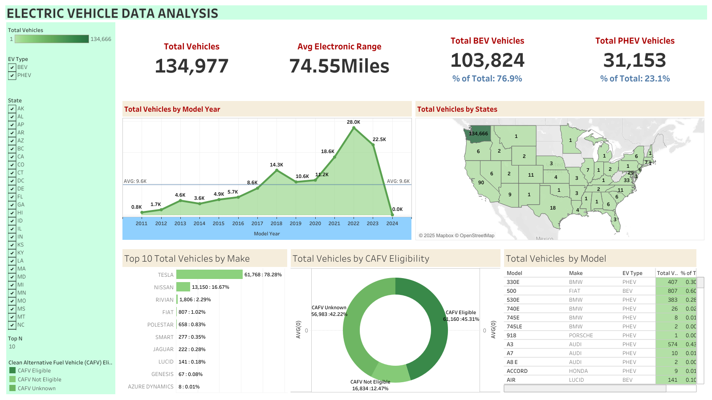

# Electric Vehicle Data Analysis Dashboard

## Overview

This project presents an interactive Tableau dashboard that visualizes the growth, distribution, and characteristics of Electric Vehicles (EVs) across the United States. The analysis provides insights into total EV count, average electric range, state-wise distribution, vehicle types, and manufacturer performance.

---

## Objectives

- Analyze electric vehicle adoption trends from 2011 to 2024.
- Compare Battery Electric Vehicles (BEV) and Plug-in Hybrid Electric Vehicles (PHEV).
- Identify top EV manufacturers and popular models.
- Examine state-wise EV distribution and CAFV eligibility.

---

## Key Insights

- **Total Vehicles:** 134,977
- **Average Electric Range:** 74.55 miles
- **Battery Electric Vehicles (BEV):** 103,824 (≈76.9%)
- **Plug-in Hybrid Electric Vehicles (PHEV):** 31,153 (≈23.1%)
- **Top Manufacturer:** Tesla (61,768 vehicles — 78.28%)
- **Peak Growth Year:** 2022

---

## Dashboard Features

- Interactive filters by EV type and state
- Yearly EV growth visualization
- Top 10 manufacturers by total vehicles
- CAFV eligibility distribution (Eligible, Not Eligible, Unknown)
- Geographic visualization of EV adoption across the U.S.

---

## Tools and Technologies

- **Tableau Public** – Dashboard creation and data visualization
- **Microsoft Excel / Python (optional)** – Data cleaning and preprocessing
- **Dataset:** Electric Vehicle Population Data (CSV format)

---

## Dataset Description

The dataset includes information such as:

- Vehicle make, model, and model year
- Electric range
- CAFV (Clean Alternative Fuel Vehicle) eligibility
- EV type (BEV / PHEV)
- Registration state

---

## Dashboard Preview

**Live Dashboard:** [View on Tableau Public](https://public.tableau.com/views/ElectricVehicle_17622237901460/ElectricVehicleDataAnalysis?:language=en-US&:sid=&:redirect=auth&:display_count=n&:origin=viz_share_link)

---

## Author

**Sidigonde Kusuma Sree **
 • [Email](mailto:your.email@example.com): skusumasrees@gmail.com

---

## Conclusion

This dashboard provides a comprehensive view of the electric vehicle landscape in the United States, highlighting adoption patterns, manufacturer dominance, and regional distribution. It serves as a valuable analytical tool for researchers, policymakers, and automotive industry professionals.
